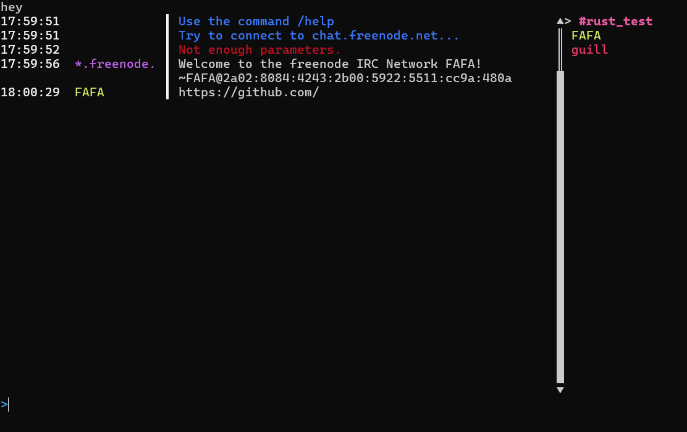
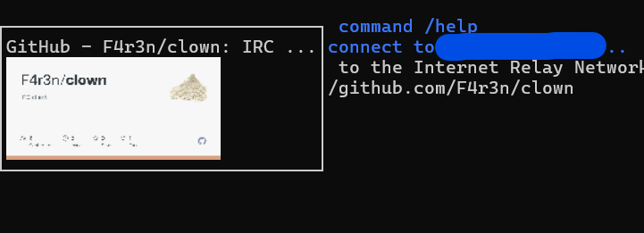

## Clown

An IRC client written in Rust, with the goal to be memory and cpu light.

## Features

* run in Terminal
* multiple channel
* preview when hovering message
* scroll with mouse/keyboard
* auto reconnect
* Can connect to only one channel (for now)

## Build

```bash
git clone https://github.com/F4r3n/clown.git
cd clown
cargo build --release
```

## Config

In Roaming/share/clown/config/clown.toml

```toml
[connection_config]
address = "localhost"
port = 6697

[login_config]
nickname = "nickname"
password = "password"
channel = "#rust-spam"

[client_config]
auto_join = true
```



