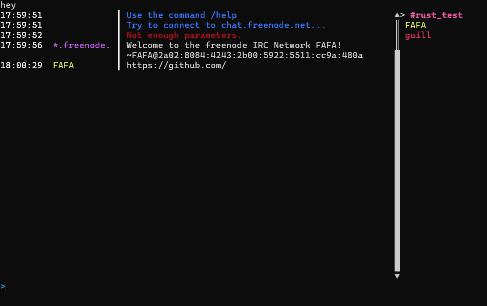
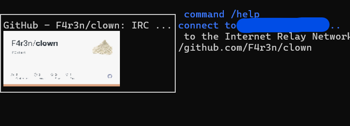

## Clown

An IRC client written in Rust, with the goal to be memory and cpu light.

## Features

* run in Terminal
* multiple channel
* multi servers
* logs
* completion
* preview when hovering message
* scroll with mouse/keyboard
* auto reconnect

## Build

```bash
git clone https://github.com/F4r3n/clown.git
cd clown
cargo build --profile dist
```

## Config

In Roaming/share/clown/config/clown.toml

```toml
[[servers]]
name = "Share"

[servers.connection]
address = "irc.address.io"
port = 6697

[servers.login]
nickname = "f4r3n"
password = "password"

[servers.channels]
list = ["#rust_test"]
auto_join = true

[completion.on_empty_input]
suffix = ": "

[completion.in_message]
suffix = " "

[nickname_colors]
seed = 18

[nickname_colors.overrides]
f4r3n = "#FFFFFF"         
```



